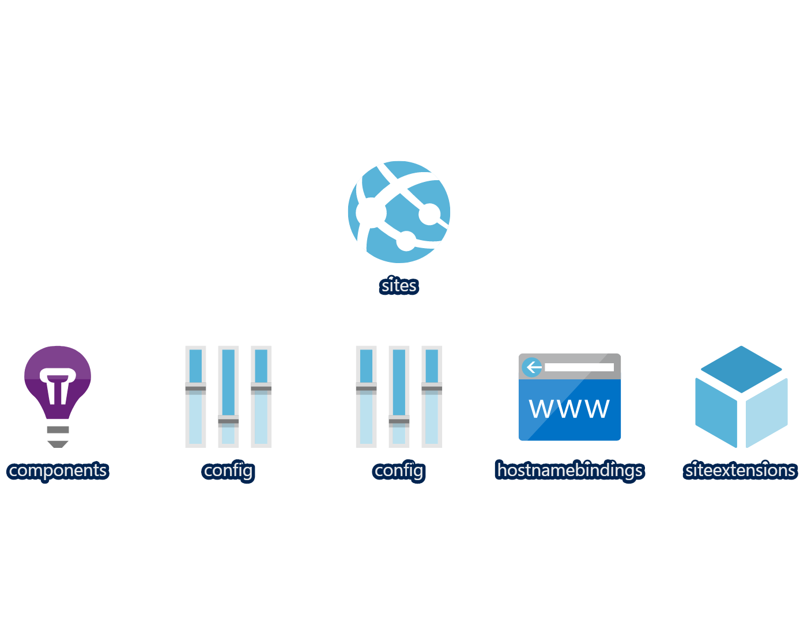

# Azure App Service with Custom App Settings and Extension ARM Templates

The template requires an existing App Service Plan.

At the moment for .Net Core 3.1 web applications the 3.1 runtime has to be installed in the Azure Service, that can be done through the Azure Portal or by ARM Templates. This template installs the runtime automatically by specifying the name of the extension and version required in the parameters.

This templates creates the following:

- 2 App Services in an existing App Service Plan
- 2 Application Insights resources for the App Services
- ASPNET_CORE_ENVIRONMENT application settings
- APPINSIGHTS_INSTRUMENTATIONKEY application settings
- Adds .Net Core runtime version 3.1

## Azure Resources

