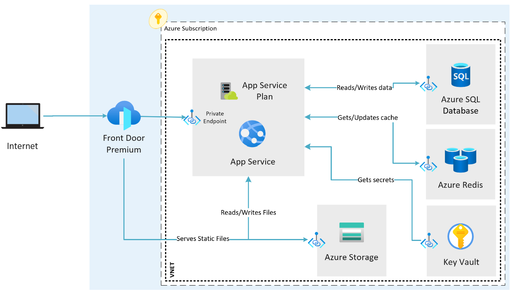

# Azure Private Endpoint Based Sample Infrastructure

Creates Azure services integrated with Azure Virtual Networks and Private Endpoints.

[Link to Test App Repository](https://github.com/goncalvesj/application-templates/tree/master/AppService-FrontDoor-PrivateEndpoints)

## Modules folder

Bicep modules that are used to define the Azure services.

- [app-service.bicep](./modules/app-service.bicep) - Creates an Azure App Service that is VNET Integrated.
- [cache-services.bicep](modules/cache.bicep) - Creates an Azure Redis cache with a private endpoint.
- [front-door-endpoint.bicep](modules/front-door-endpoint.bicep) - Creates the Azure Front Door endpoints for the App and Storage.
- [front-door.bicep](modules/front-door.bicep) - Creates the Azure Front Door service.
- [key-vault.bicep](modules/key-vault.bicep) - Creates Azure Key Vault.
- [network.bicep](modules/network.bicep) - Creates Azure Virtual Network and Subnets.
- [private-endpoints.bicep](modules/private-endpoints.bicep) - Creates Azure Private Endpoints for the various services.
- [storage.bicep](modules/storage.bicep) - Creates Azure Storage Account and blob container.
- [sql.bicep](modules/sql.bicep) - Creates Azure SQL Server and Database.

## Files

[main.bicep](main.bicep) - Main Bicep file that creates the Azure services.

[deploy.ps1](deploy.ps1) - PowerShell script to execute the deployment of the Bicep files.

## Architecture

## Deployment

Use the VS Code Bicep extension to deploy the Bicep files. Right click on the [main.bicep](main.bicep) file and select "Deploy Bicep File". Save the deployment parameters in a file for future use.

Execute the [deploy-bicep.ps1](deploy-bicep.ps1) PowerShell script to deploy the Bicep files. Needs a deployment parameters file as input.

### TODO

- Create Azure Application Insights to be used by the test app.
- Create Managed Identities and Azure Role Assignments.
- Add secrets to Azure Key Vault to be used by the test app.
- Update templates to use existing Azure Landing Zone resources (Log Analytics, Private DNS Zones, etc.)
